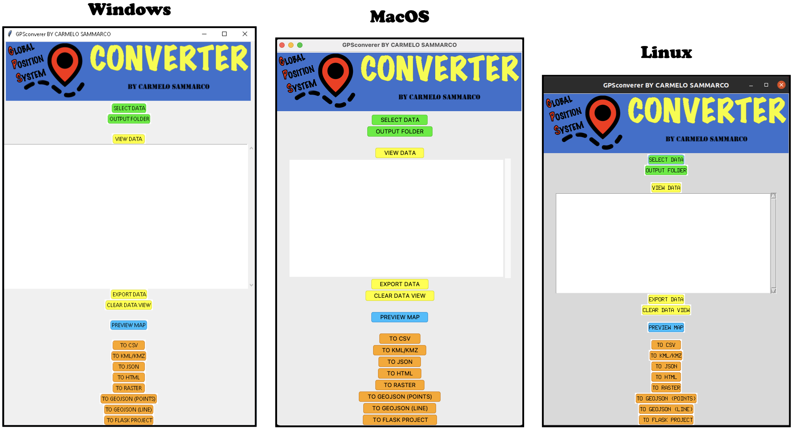

# GPSconverter (Global-Positioning-System Converter)

[](https://travis-ci.com/carmelosammarco/GPSconverter)[](https://pypi.org/project/GPSconverter/)

<p align="center">
  
</p>

Python application to manipulate & view GPS data. The tool born while I was doing some trekking because I wanted a fast way to convert and plot all the GPS file saved automatically and with the minimal effort. :) Hope you like it! 

It can be usefull when:

- You want to visualise your GPS raw data, modified them and export as txt file.

- You want to show your GPS data on a map which can be done with a render of the folium HTML web page (depending on your browser this fuction might not work) or using the powerfull Generic Mapping Tool (GMT) for a more professional result. 

- You want to create a Flask project to be run in your local network or in a server and then make it avaiable outside your local network.

- You need to convert GPS data (as CSV or GPX) to other formats (for example the tracks/waypoints of your outdoor activity) for further processing/scopes you could have.

- You want to visualize your data using the native Google Earth engine extention (KML/KMZ)

- You want to generate an HTML file ready for be embedded in your website. 

and many more can be added.... 

**Inside the project folder (GPSconverter)/DATA you can find a "test_data" folder with inside a GPX file so to be able to use the application and verify that all work well.**

## Installation

- **The best way** is create an ad-hoc environment using the anaconda environment installer which I tailored to the main operative sistem used. To create with just one command all the packages needed and install the GPSconverter application just run one of the commands below:

  ```
  conda env create csammarco/GPSX-MacOS  # For Macintosh

  conda env create csammarco/GPSX-Win    # For Windows

  conda env create csammarco/GPSX-Unix   # For Linux distribution (Ubuntu for example)
  ```

  You can download/view the environment files ".yml" by clicking one of the badges here below: 

  For Macintosh --> [](https://anaconda.org/CSammarco/GPSX-MacOS)

  For Window --> [](https://anaconda.org/CSammarco/GPSX-Win)

  For Unix distro --> [](https://anaconda.org/CSammarco/GPSX-Unix)

- Another way is to install the entire environment manually (which I called "myenv" in the example below). To do so please to run the code in the following order:

  ```
  conda create --name myenv python=3.8 
  ```

  Activate the environmet created above with:

  ```
  conda activate myenv
  ```

  Now time to install all the dependencies needed by:

  ```
  conda install gmt fiona -c conda-forge

  pip install GPSconverter
  ```

**No matter which path you followed, now you have all the packages needed instaled in your envirnment and the GPSconverter Application installed too!** 

**To run the application just type on your terminal/command-propt the following:**

```
GPSconverter
```

At this point a GUI interface will pop up and you are ready to go! 

Below is what you are going to see for the MacOS (The GUI are a bit different for different OS and it is totally normal):

<p align="center">
  
</p>


## Conversions avaiable

- **Convert from CSV to GPX**

- **Convert from GPX to CSV**

- **Convert from GPX to JSON**

- **Convert from GPX to HTML**

- **Convert from GPX to KML/KMZ**

- **Convert from GPX to GeoJSON(LINE)**

- **Convert from GPX to Shapefile(LINE)**

- **Convert from GPX to GeoJSON(POINTS)**

- **Convert from GPX to Shapefile(POINTS))**

## MAPS avaiable:

- **GPX to GMT-MAP**

- **CSV to GMT-MAP**

- **HTML to RASTER**

- **HTLM to FLASK-PROJECT**

## Others information:

**I have still ideas and improvements that can be done ( it is an infinite process and it will never stop for me) but anyway it is a good base to start with... Feel free to "fork" and contribute if you wish!**

Also I am trying to realise a stand-alone executable to run  natively for both Window and MacOS operative systems. However, it is still a working in progress. There is a folder called Script where all is set to make the executable. I tried many tools as py2exe, pyinstaller, py2app but i did not find still a stable recepie. 

Eventually if I will manage and especially if i find the time to dedicate to it, this will be the app icon:


Enjoy :)