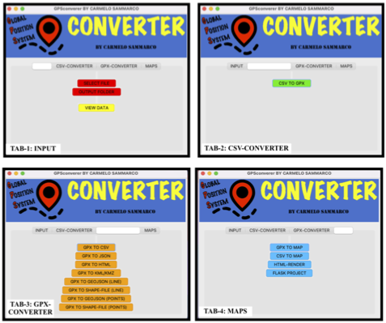

# GPSconverter (Global-Positioning-System Converter)

[](https://travis-ci.com/carmelosammarco/GPSconverter)   [](https://pypi.org/project/GPSconverter/)  

<p align="center">
  
</p>

Python application to manipulate & view GPS data. The tool born while I was doing some trekking because I wanted a fast way to convert and plot all the GPS file saved automatically and with the minimal effort. :) Hope you like it! 

It can be usefull when:

- You want to visualise your GPS raw data, modified them and export as txt file.

- You want to show your GPS data on a map which can be done with a render of the folium HTML web page (depending on your browser this fuction might not work) or using the powerfull Generic Mapping Tool (GMT) for a more professional result. 

- You want to create a Flask project to be run in your local network or in a server and then make it avaiable outside your local network.

- You need to convert GPS data (as CSV or GPX) to other formats (for example the tracks/waypoints of your outdoor activity) for further processing/scopes you could have.

- You want to visualize your data using the native Google Earth engine extention (KML/KMZ)

- You want to generate an HTML file ready for be embedded in your website. 

and many more can be added.... 

**Inside the project folder (GPSconverter)/DATA you can find a "test_data" folder with inside a GPX file so to be able to use the application and verify that all work well.**

## Installation

- **The best way** is create an ad-hoc environment using the anaconda environment function which I tailored to the main Operative System (OS) used. To download and install  with just one command all the packages needed including the installation of the GPSconverter application just run the command below after have downloaded the GPSconverter.yml file corrispective  [HERE](https://anaconda.org/CSammarco/GPSconverter/files) and related to your operative system (OS value written in the "TAG" parameter: Mac, Win and UNIX-tested on linux Ubuntu-) 

  ```
  conda env create -f GPSconverter.yml  
  ```

- Another way is to install the entire environment manually (which I called "myenv" in the example below). To do so please to run the code in the following order:

  ```
  conda create --name myenv python=3.8 
  ```

  Activate the environmet created above with:

  ```
  conda activate myenv
  ```

  Now time to install all the dependencies needed by following the order of the commands below:

  ```
  conda install -c conda-forge gmt geopandas 

  pip install GPSconverter
  ```

**No matter which path you followed, now you have all the packages needed instaled in your envirnment and the GPSconverter Application installed too!** 

**To run the application just type on your terminal/command-propt the following:**

```
GPSconverter
```

At this point a GUI interface will pop up and you are ready to go! 

Below is what you are going to see for the Macintosh Operative System (The GUI are a bit different for different OS because clearly the GUI is adapting the internal graphical libraries):

<p align="center">
  
</p>


## Conversions avaiable

- **Convert from CSV to GPX**

- **Convert from GPX to CSV**

- **Convert from GPX to JSON**

- **Convert from GPX to HTML**

- **Convert from GPX to KML/KMZ**

- **Convert from GPX to GeoJSON(LINE)**

- **Convert from GPX to Shapefile(LINE)**

- **Convert from GPX to GeoJSON(POINTS)**

- **Convert from GPX to Shapefile(POINTS))**

## MAPS avaiable:

- **GPX to GMT-MAP**

- **CSV to GMT-MAP**

- **HTML to RASTER**

- **HTLM to FLASK-PROJECT**

## Others information:

**I have still ideas and improvements that can be done ( it is an infinite process and it will never stop for me) but anyway it is a good base to start with... Feel free to "fork" and contribute if you wish!**

I hope you like and you find usefull, here below an usage video example. The starting data will be a CSV file. I will view it before convert it to GPX and realise an high quality overview topographic map. Then I will convert as KML/KMZ  to be visualised on google earth for a more interactive viewing. But much more can be done. It is very intuitive, just explore the different functions!


<div align="center">
      <a href="https://www.youtube.com/watch?v=StTqXEQ2l-Y">
     
      </a>
    </div>

Enjoy! :)
